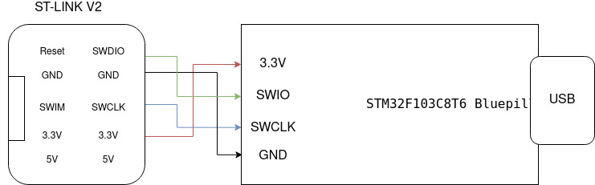
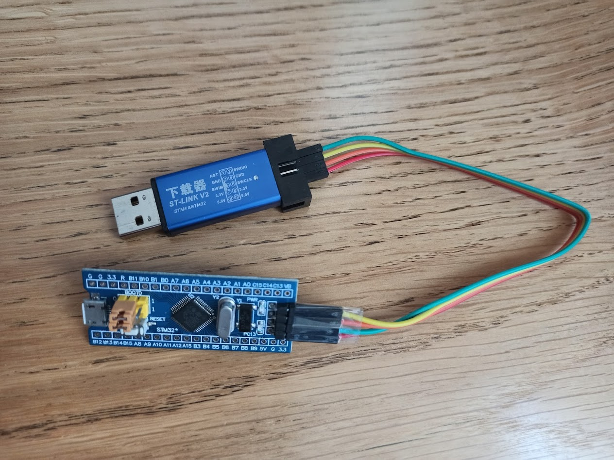

# STM32F103C8T6 Bluepill Simple Build

Since buying my first Bluepill a couple of years ago I've had a couple of very half-assed attempts to get them running. Only really having success through long and tedious processes that involve a lot of manual command entry, by no means enabling a smooth development process.

Since doing a lot of work with STM32F4s and CMake, such as [this](https://github.com/alxhoff/STM32-uGFX-Cmake) STM32F4 uGFX/FreeRTOS build, [STM32F4 Tensorflow Micro](https://github.com/alxhoff/STM3240G-EVAL-TensorFlow-Hello-World) and the great [STM32 CMake](https://github.com/ObKo/stm32-cmake) project that I've been contrinbuting to, things have gotten a bit smoother.

As such, now when I decided to set up a simple build system it was a lot easier. Hopefully this will also enable others to make better use of the bluepill as it is such a great and cheap board.

## Board Configuration

As seen in the image below, both jumpers should be in the '0' position, on the USB port's side. I have been programming the board with a Chinese ST-Link clone and the pinout is straight forward. GND and 3.3V should be connected as well as SWDIO and SWCLK, see my bad ass pinout graphic.

STM libraries are automatically pulled from [here](https://github.com/alxhoff/STM32F1-Cube-Firmware) and put into a `lib` directory where the cmake modules will find them and use in the build.





## Build configuration

The default build is configured to use FreeRTOS and the STM HAL library, the required components can be easily set from [`CMakeLists.txt`](CMakeLists.txt#L42).

I might get around to doing a STD peripherals library build at some point. 

## Build sources

The build sources were generated from STM Cube MX and you are able to do the same if you are wishing to customize your build and generate the sources yourself. Startup ASM, system c and the linker script are automatically resolved by the cmake modules found in the [`cmake`](cmake) directory. You should only need to populate the [`inc`](inc) and [`src`](src) folders.

## Prerequisites

### Arch/Manjaro

It's hard for me to say exactly which packages I have installed becuase I have not modified the toolchain on my machine in years. On my arch system I believe the required packages are

``` bash
yaourt arm-none-eabi-binutils arm-none-eabi-gcc arm-none-eabi-gdb cmake openocd
```
The complete toolchain `gcc-arm-none-eabi-bin` does not contain GDB and as such you can just get `gcc` and `gdb`.

### Debain/Ubuntu

Debian based users should only need the packages

``` bash
sudo apt-get install -y gcc-arm-none-eabi cmake openocd
```

## Building, Flashing and Debugging

The entire idea of the build was to make it simple. As such the process is pretty standard.

### Building

``` bash
mkdir build
cd build
cmake ..
make
```

### Flashing

``` bash
make flash
```

### Debugging

``` bash
make debug
```

### Cleaning

``` bash
make clean #Removes build files
```
or

``` bash
make clean_all #Removes cmake files, build files and libraries
```

Enjoy.